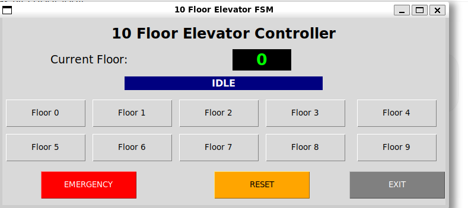

# Lift-FSM-in-Verilog-along-with-TCL-GUI

This project implements a digital controller for a 10-floor elevator system consisting of Ground Floor (Floor 0) through Floor 9. The elevator behavior is modeled using a Finite State Machine (FSM) and verified using simulation testbenches in Icarus Verilog. A Tcl/Tk GUI provides an interactive frontend for issuing floor requests, triggering emergency stops, resetting the controller, and visualizing simulation waveforms.

## Features

* 10-floor elevator support (Ground Floor to Floor 9)
* FSM-based control architecture
* Upward and downward movement control
* Emergency stop handling
* Reset functionality
* Priority-based floor request selection
* GTKWave waveform generation and visualization
* Interactive Tcl/Tk graphical interface
* Dynamic testbench generation through the GUI
* Simulation using Icarus Verilog

## GUI Preview



## Elevator FSM States

The controller operates using four states:

| State       | Description                                     |
| ----------- | ----------------------------------------------- |
| `IDLE`      | Elevator is stationary and waiting for requests |
| `MOVE_UP`   | Elevator moves upward toward the target floor   |
| `MOVE_DOWN` | Elevator moves downward toward the target floor |
| `EMER`      | Emergency stop mode                             |

### State Transitions

* `IDLE -> MOVE_UP` when requested floor > current floor
* `IDLE -> MOVE_DOWN` when requested floor < current floor
* `MOVE_UP -> IDLE` when target floor is reached
* `MOVE_DOWN -> IDLE` when target floor is reached
* `ANY_STATE -> EMER` when emergency stop is asserted
* `EMER -> IDLE` when emergency stop is released

## Priority Logic

The controller uses fixed-priority scheduling. When multiple floor requests are active simultaneously, the lowest floor number receives the highest priority.

Example:
```text
floor_req = 10'b1010010001
```
Requested floors: 9, 6, and 0
Selected target floor: 0

## Project Architecture

```text
                 +----------------+
                 |  Tcl/Tk GUI    |
                 +--------+-------+
                          |
                          | Generates temp_tb.v
                          v
                 +----------------+
                 | Icarus Verilog |
                 +--------+-------+
                          |
                          v
                 +----------------+
                 | elevator_fsm.v |
                 +--------+-------+
                          |
                          v
                 +----------------+
                 |   wave.vcd     |
                 +--------+-------+
                          |
                          v
                 +----------------+
                 |    GTKWave     |
                 +----------------+
```

## File Description

### `elevator_fsm.v`

Main Verilog implementation of the elevator controller FSM.

Responsibilities:

* State transitions
* Floor tracking
* Priority handling
* Movement control
* Emergency stop handling

### `elevator_tb.v`

Standalone verification testbench used for waveform analysis.

Included test scenarios:

1. Ground Floor to Floor 9
2. Floor 9 to Floor 3
3. Multiple simultaneous requests
4. Emergency stop during motion
5. Reset during operation

### `elevator_gui.tcl`

Tcl/Tk frontend for interactive simulation.

Features:

* Floor selection buttons
* Current floor display
* Status monitoring
* Emergency stop control
* Reset functionality
* Automatic waveform generation
* GTKWave integration

The GUI dynamically generates temporary testbenches (`temp_tb.v`) during runtime.

## Prerequisites

### Ubuntu/Debian

Install all required packages:

```bash
sudo apt update

sudo apt install -y \
    iverilog \
    gtkwave \
    tcl \
    tk \
    tcllib \
    tk-dev
```

Verify installation:

```bash
iverilog -V
vvp -V
gtkwave --version
tclsh
```

## Usage

### Run Standalone Simulation

Compile the FSM and testbench:

```bash
iverilog -o lift_sim elevator_fsm.v elevator_tb.v
```

Run simulation:

```bash
vvp lift_sim
```

Open waveform:

```bash
LIBGL_ALWAYS_SOFTWARE=1 gtkwave wave.vcd
```

### Run GUI Application

Launch the Tcl/Tk frontend:

```bash
tclsh elevator_gui.tcl
```

Workflow:

1. Click a floor button.
2. The GUI generates `temp_tb.v`.
3. Icarus Verilog compiles the design.
4. Simulation runs automatically.
5. `wave.vcd` is generated.
6. Click "OPEN GTKWAVE" to inspect signals.

## Important Signals

| Signal          | Width | Description            |
| --------------- | ----- | ---------------------- |
| `clk`           | 1     | System clock           |
| `rst`           | 1     | Active-high reset      |
| `floor_req`     | 10    | Floor request vector   |
| `emer_stop`     | 1     | Emergency stop input   |
| `move_up`       | 1     | Upward motor control   |
| `move_down`     | 1     | Downward motor control |
| `motor_stop`    | 1     | Stop motor signal      |
| `current_floor` | 4     | Current elevator floor |

## Verification Scenarios

The design has been tested for:

* Single floor requests
* Upward movement
* Downward movement
* Multiple simultaneous requests
* Priority resolution
* Emergency stop handling
* Reset recovery
* Idle state behavior

## Known Limitations

* Fixed priority scheduling may lead to starvation of higher floors.
* Only one target floor is serviced at a time.
* No request queue implementation.
* No door open/close control logic.
* No overload detection.
* No timing constraints or synthesis validation.

## Future Improvements

* Request queue implementation
* Direction-aware scheduling
* Door control FSM
* Seven-segment floor display
* FPGA deployment
* SystemVerilog assertions
* Coverage-driven verification
* UVM-based testbench
* Sensor integration

## Reference

The FSM design approach was inspired by the following tutorial series:

https://www.youtube.com/watch?v=GgzwLW2je8A&list=PLqPfWwayuBvPYYQS2h5p622vGR6aZIfux&index=39
